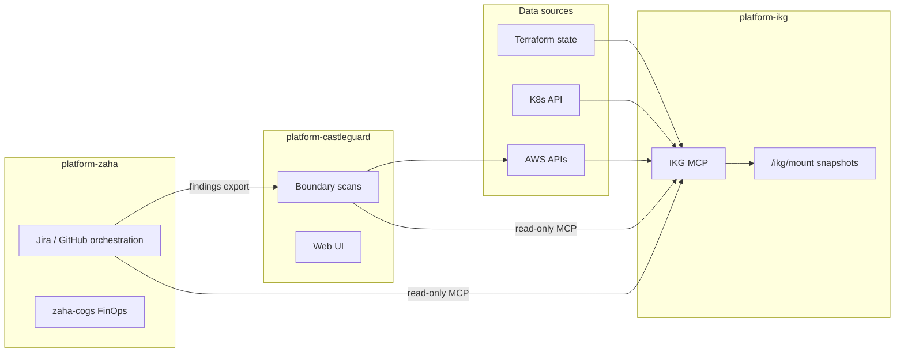

# Platform agents

Three platform agents on **platform-eks**, each with a dedicated namespace. Future repos: `platform-ikg`, `platform-castleguard`, `platform-zaha` (no language suffix).

## Relationship diagram

## Agent index

| Agent | Repo (future) | Role | Doc |
|-------|---------------|------|-----|
| IKG | `platform-ikg` | Infra knowledge graph — inventory, linkage, MCP tools | [platform-ikg.md](platform-ikg.md) |
| Castleguard | `platform-castleguard` | Agentic red team — boundary, exposure, compliance | [platform-castleguard.md](platform-castleguard.md) |
| Zaha | `platform-zaha` | Architecture review, FinOps, Jira/GitHub orchestration | [platform-zaha.md](platform-zaha.md) |

When `platform-{ikg,castleguard,zaha}` repos exist, their `README.md` should link here for access patterns.
