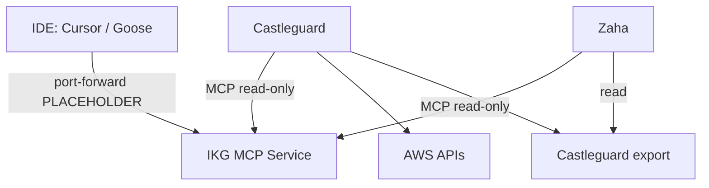

# MCP interlink map

How platform agents, services, and IDE tools connect. **Scaffold only** — fill connection details locally; never commit secrets.

## Table

| From | To | Protocol | Direction | Notes |
|------|-----|----------|-----------|-------|
| Castleguard pod | IKG MCP Service | MCP | read-only | `ikg_search`, `ikg_get_node`, `ikg_traverse` |
| Zaha | IKG MCP | MCP | read-only | Architecture / FinOps correlation |
| Zaha | Castleguard export | S3 / API | read | Findings for cost/security overlap |
| IDE (Cursor/Goose) | IKG MCP | MCP stdio / port-forward | read | v1: `kubectl port-forward` stub |
| Castleguard | AWS APIs | AWS SDK | read / probe | Boundary checks |
| Zaha | Grafana MCP (org lane) | MCP | read | Metrics — **org MCP**, not platform-bots |

## Diagram



## Placeholder connection examples

```bash
# PLACEHOLDER — verify via approved cluster access; document pattern in PR only
# IKG MCP (in-cluster): infra-kg-mcp.infra-kg.svc.cluster.local:<PORT>
kubectl port-forward -n infra-kg svc/infra-kg-mcp <LOCAL_PORT>:<REMOTE_PORT>
```

```json
{
  "mcpServers": {
    "ikg": {
      "command": "PLACEHOLDER",
      "args": ["PLACEHOLDER — local MCP proxy or port-forward wrapper"]
    }
  }
}
```

Do not commit real tokens, personal paths, kubeconfig contents, or customer-identifying data.
