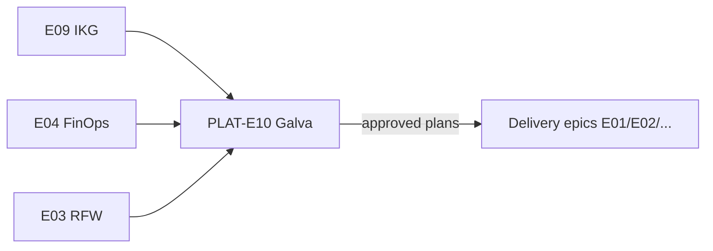

# Galva program brief

**Jira Epic:** [PLAT-96](https://catalystsoftware.atlassian.net/browse/PLAT-96) (E10 — Galva)  
**Future repo:** `totango/platform-galva` (not created in this pass)  
**Board:** [PLAT](https://catalystsoftware.atlassian.net/jira/software/c/projects/PLAT/summary)

## What is Galva?

**Galva** is a platform program for **research and planning** on how to modernize, improve cost efficiency, migrate, and refactor older codebases. Galva does **not** execute production changes — it produces strategies, estimates, and risk analysis for humans to approve and deliver under separate epics.

```
Facts in (topology, deps, versions, constraints)
        │
        ▼
┌───────────────────┐
│  Galva research   │  AST / static analysis per language
│  + platform ctx   │  deployment patterns, VPC/EKS limits
└─────────┬─────────┘
          │
          ▼
Strategy out: savings · effort · risk · blast radius · phases
```

## Sizing: big vs small galvas

| Size | Scope | Example | Typical output |
|------|-------|---------|----------------|
| **Small galva** | Single program, one service, narrow infra move | Move one worker to shared Temporal namespace | 1–2 week research; focused migration plan |
| **Big galva** | Service group, cross-cutting refactor, multi-cluster | Consolidate ingest pipeline onto shared platform services | Multi-sprint research; phased program with checkpoints |

Use **effort**, **risk**, and **blast radius** together — a small code change with wide consumer impact may still be a **big galva**.

## Intake template (facts in → strategy out)

Every galva starts with a structured intake. Fill what is known; mark unknowns explicitly.

| Field | Description | Example (placeholder) |
|-------|-------------|-------------------------|
| **Workload name** | Service or repo identifier | `catalyst-ingest` |
| **Languages / runtimes** | Primary stacks | Java 11, Go 1.21, Python 3.9 |
| **Deployment** | Cluster, namespace, account (no secrets) | Dedicated EKS in `<AWS_ACCOUNT>`, same VPC as shared services |
| **Dependencies** | Data stores, queues, external APIs | PostgreSQL, Temporal `<VERSION>`, S3 |
| **Consumers** | Who depends on this workload | Downstream `<SERVICE_A>`, batch jobs |
| **Constraints** | VPC, region, compliance, uptime | Same-VPC only; no cross-region DB today |
| **Cost signals** | Known waste or duplication | Dedicated Temporal cluster vs shared |
| **Goal** | What “better” looks like | Migrate to shared Temporal; upgrade workflow SDK |

**Output sections** (every galva deliverable):

1. Current-state architecture (verified or marked `TBD`)
2. Target-state options (≥2 where feasible)
3. Cost / efficiency comparison (qualitative OK for v1)
4. Effort estimate (T-shirt + dependencies)
5. Risk register + blast radius
6. Recommended phases + rollback strategy
7. Proposed follow-up delivery tickets (human review — no bulk create)

## Language-agnostic analysis

Galva must work across **Java, Python, Go**, and other stacks without assuming one toolchain.

| Ecosystem | Analysis approach (research) | Derives |
|-----------|------------------------------|---------|
| **Java** | AST via parser (e.g. JavaParser) or build-tool graph (Maven/Gradle) | Service boundaries, Temporal workflow/activity usage, JDBC deps |
| **Python** | `ast` module, import graph, optional type hints | Worker entrypoints, ORM usage, async patterns |
| **Go** | `go/ast`, module graph, static call graph | Temporal SDK usage, gRPC clients, config loading |
| **Infra** | Terraform/K8s manifests, Helm values (from approved repos) | Cluster placement, IAM, network paths |

Galva should **compose** language-specific extractors behind a common intake schema rather than one monolithic analyzer.

## Platform context Galva needs

Galva research quality depends on deployment and platform knowledge:

| Source | Use |
|--------|-----|
| **IKG (E09)** | Service topology, AWS/K8s/TF relationships |
| **Castleguard** | Boundary and security findings |
| **FinOps (E04)** | Cost baselines and savings hypotheses |
| **RFW (E03)** | Proactive debt that migrations should not repeat |
| **Access docs** | How engineers reach clusters, DBs, shared services |
| **PLAT-95** | Teleport / multi-cluster / DB access patterns |

## Relationship to other PLAT epics



- **Galva (E10)** — research and migration **planning**
- **RFW (E03)** — prevent repeat pain; galva findings often spawn RFW stories
- **FinOps (E04)** — savings validation; Zaha may feed cost signals into intake
- **Delivery epics** — execute approved migrations after galva sign-off

## Privacy and content rules

- No customer names, tenant IDs, or production hostnames in git or Jira bodies
- No secrets, tokens, or personal machine paths
- Use `~/.config/<repo_name>/config.yaml` for local tooling references only
- Obfuscate examples: `<CUSTOMER>`, `<TENANT_ID>`, `<CLUSTER_NAME>`

## Stories under E10

| Key | Summary |
|-----|---------|
| [PLAT-97](https://catalystsoftware.atlassian.net/browse/PLAT-97) | platform-galva — intake model and multi-language research scaffold |
| [PLAT-98](https://catalystsoftware.atlassian.net/browse/PLAT-98) | Galva: catalyst-ingest migrate to shared Temporal (example inaugural galva) |

## Next steps

1. Review and approve [PR for galva docs](https://github.com/totango/platform-tools/pulls) (branch `ab/galva-epic`)
2. Scaffold `totango/platform-galva` repo when ready (separate ticket)
3. Execute PLAT-98 research brief — [galva-catalyst-ingest.md](./galva-catalyst-ingest.md)
